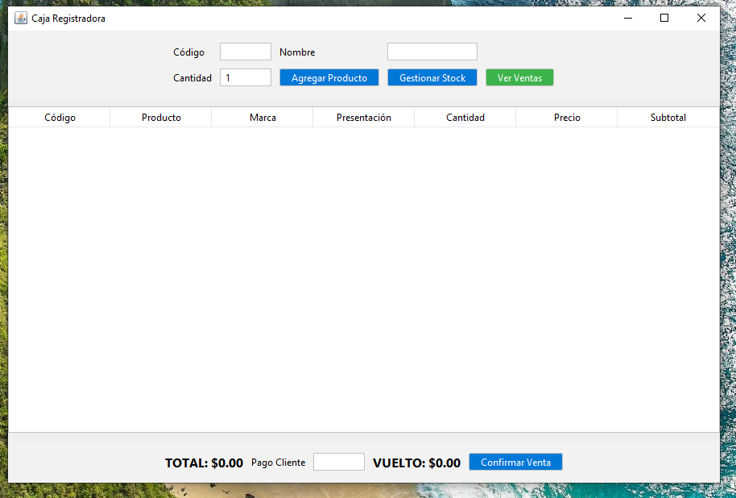
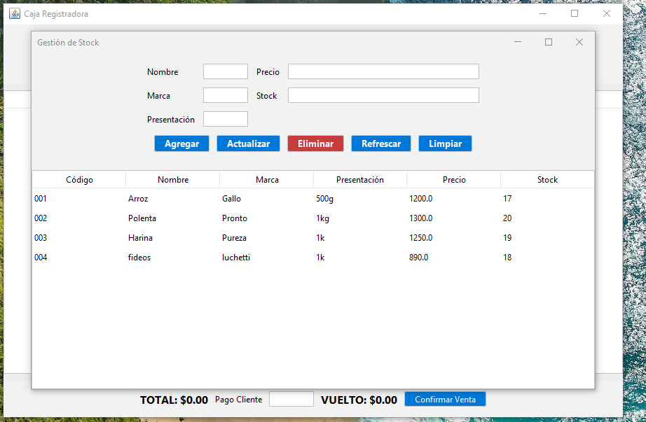

# 🛒 Programa de Ventas

Este proyecto fue desarrollado en **Java con NetBeans**.  
Ejemplo de un sistema sencillo de gestión de ventas.
Use Java24

--

## 🚀 Características
- Registro de productos
- Stock
- Procesamiento de ventas
- Reportes básicos

---

## 📸 Capturas de pantalla

Pantalla principal:  

Pantalla de ventas:  

---

## 👩‍💻 Autor
**Alejandra Córdoba**

